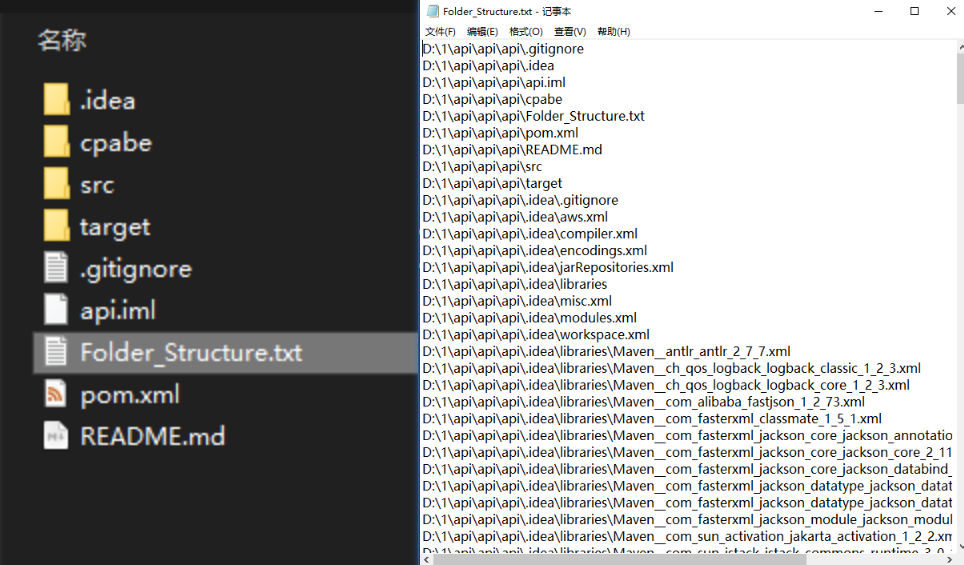

# Tree_This_Folder

### 为你的右键添加 tree 命令功能，快速生成复制文件夹结构,便于 ChatGPT/你的同事 理解你的项目结构，使用 windows 批处理脚本实现。（生成 markdown 由 Python 实现）

#### Enhance your right-click menu with a 'tree' command feature to quickly generate and copy the folder structure, aiding in the clear understanding of your project structure by ChatGPT/your colleagues, realized through a Windows batch script.

实现效果如图：

### 点击后，会自动将当前所处文件夹的子文件夹结构复制到剪切板（可选功能：并输出生成 txt 文件）

# 使用方法：

#### 只需要复制功能，则使用 **管理员权限** 运行 `仅复制` 文件夹下的 `add1.bat`即可。

#### 需要复制且在输出 txt 功能，则使用 **管理员权限** 运行 `复制且输出txt` 文件夹下的 `add0.bat`即可。

#### 需要复制且在输出 txt 或 markdown 功能，则使用 **管理员权限** 运行 `复制且输出md或txt` 文件夹下的 `add0.bat`即可。

演示视频：
<video src="%E5%A4%8D%E5%88%B6%E4%B8%94%E8%BE%93%E5%87%BAmd%E6%88%96txt.mp4" controls title="Title"></video>
输出 txt 效果如下：

输出 markdown 效果如下：

markdown 导入 xmind 效果如下：

请注意，后续使用请保持 main bat 文件路径稳定(因为原理为每次使用时调用)，建议放在**不易改变的路径**下

#### **如需复原，管理员权限执行`remove.bat`即可。**
