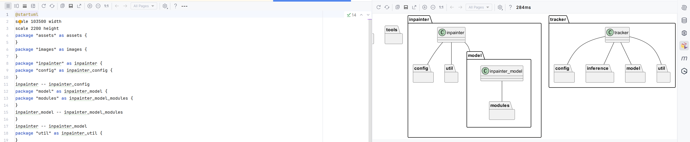
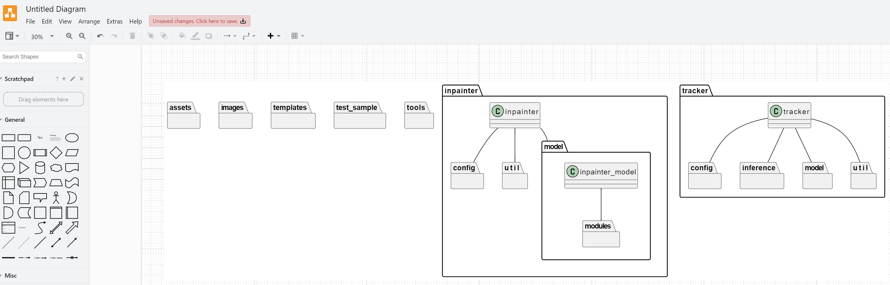

# Tree_This_Folder

## 为你的右键添加 ~~"tree"~~ (Dir) 功能，快速生成复制文件夹结构,便于 ChatGPT/你的同事 理解你的项目结构，使用 windows 批处理脚本实现。（生成 markdown 由 Python 实现）

## Enhance your right-click menu with a ~~'tree'~~ (Dir) command feature to quickly generate and copy the folder structure, aiding in the clear understanding of your project structure by ChatGPT/your colleagues, realized through a Windows batch script. (The function of generating markdown is implemented by Python)

---
# 经测试 md 相关功能在win10可能出现命令行太长无法识别，后续将尝试修复，可以暂时使用Release下的原始版本。

# ✨ 实现效果如图：

1. 仅复制到剪贴板 / 复制且输出 txt / 复制且输出 md 右键菜单效果 （点击即用）：

2. 复制且输出 md 或 txt 右键菜单效果 （通过子菜单选择输出 md 还是 txt）：

3. 输出 txt 效果

4. txt 导入 ChatGPT 效果：

5. 输出 markdown 效果

6. markdown 导入 xmind 效果

7. 输出plantuml 效果
    
8. plantuml 导入 draw.io 效果
    
---

# ➕ 使用方法：

## 演示视频：

[Tree_This_Folder 复制且输出 md 或 txt 演示视频](https://www.bilibili.com/video/BV1r5411B7FY/)

<video src="assets/%E5%A4%8D%E5%88%B6%E4%B8%94%E8%BE%93%E5%87%BAmd%E6%88%96txt.mp4" controls title="Title"></video>

---

## 1. 只需要复制到剪贴板功能

使用 🛡️**管理员权限** 运行 📁`仅复制` 文件夹下的 `add1.bat`即可。

## 2. 需要复制且输出 txt 功能

使用 🛡️**管理员权限** 运行 📁`复制且输出txt` 文件夹下的 `add0.bat`即可。

## 3. 需要复制且输出 txt 或 markdown 功能

使用 🛡️**管理员权限** 运行 📁`复制且输出md或txt` 文件夹下的 `add0.bat`即可。

## 4. 需要复制且输出 txt 或 markdown 或 plantuml 功能

使用 🛡️**管理员权限** 运行 📁`复制且输出md或txt或puml` 文件夹下的 `add0.bat`即可。

---

# ❗ 请注意:

后续使用请保持 main bat 文件路径稳定（因为原理为每次使用时调用），建议放在**不易改变的路径**下

---

# 🗑️ 卸载与移除

如需复原，使用 🛡️**管理员权限** 运行 `remove.bat`即可。

使用 复制且输出 md 或 txt ，卸载与移除需运行 📁`复制且输出md或txt` 文件夹下的 `remove.bat`。

使用 复制且输出 md 或 txt 或 plantuml 功能 ，卸载与移除需运行 📁`复制且输出md或txt或puml` 文件夹下的 `remove.bat`。
