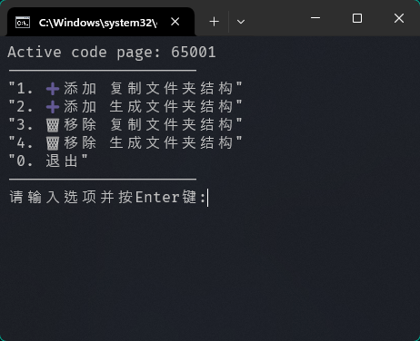
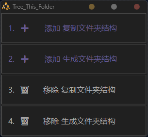
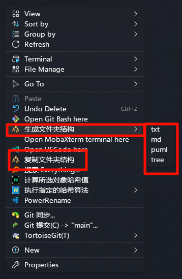
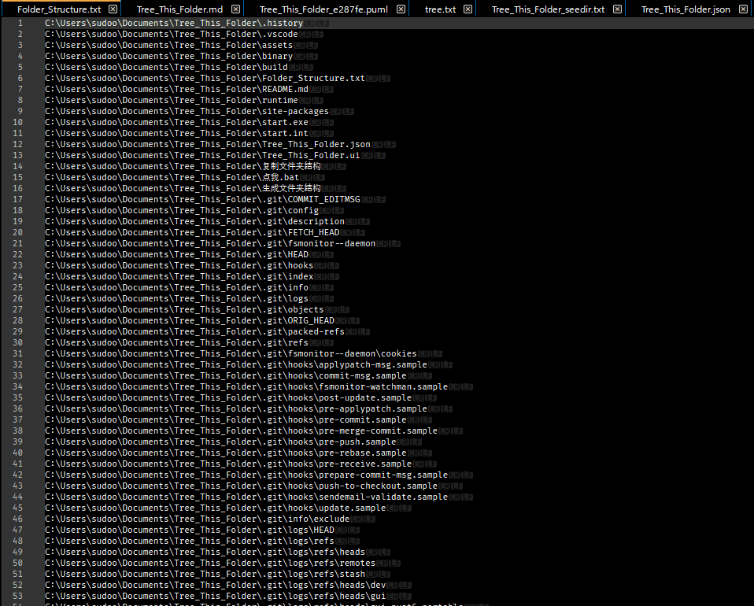
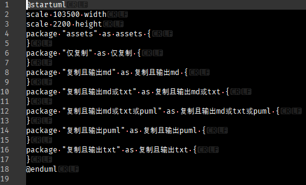
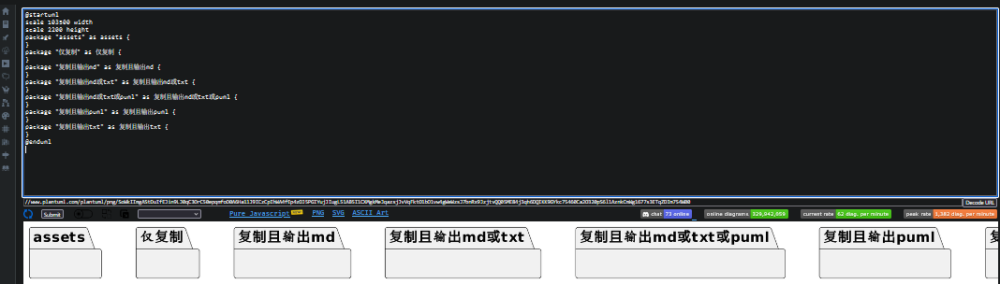
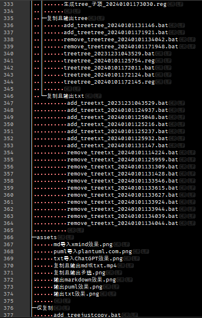
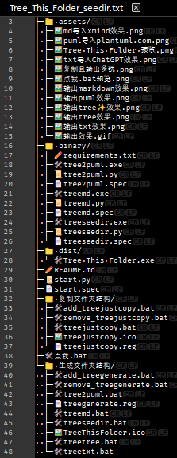
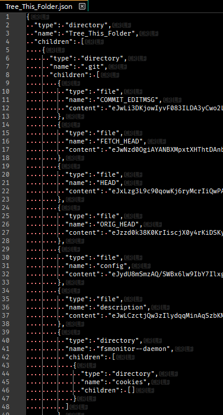
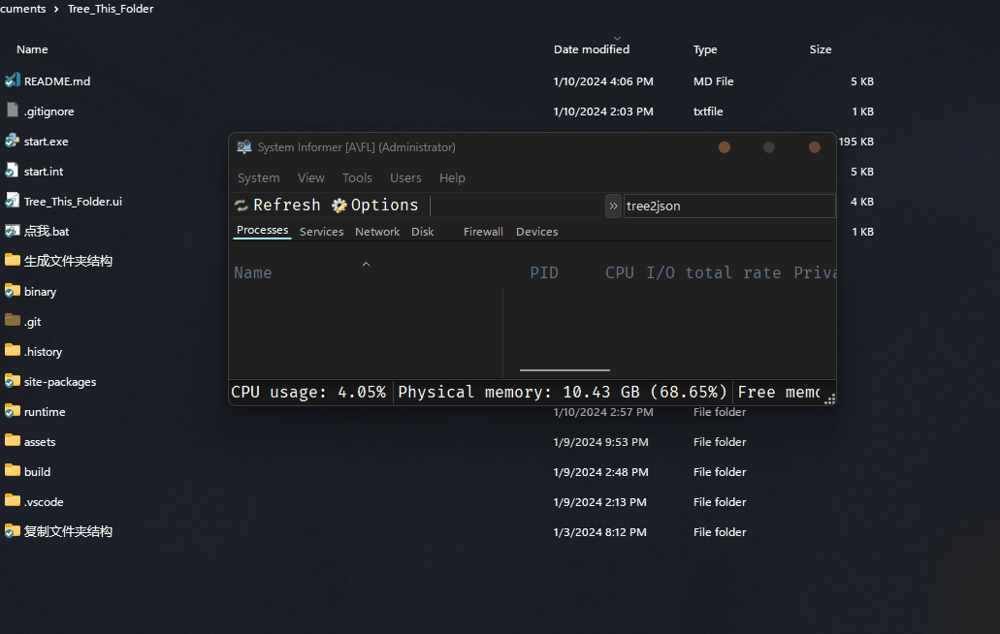

# Tree_This_Folder

## 为你的右键添加 复制、生成文件夹结构 功能。便于 ChatGPT / 你的同事 理解你的项目结构。使用 bat 脚本 和 Python 实现，目前已支持 `生成 txt、markdown、puml、Windows默认tree、Emoji增强tree、json` 六种生成格式。

## Add copy and generate folder structure for your right-click. Make it easy for ChatGPT/your colleagues to understand your project structure. Use bat script and Python implementation. Currently it supports six generation formats: TXT, Markdown, puml, Windows default tree, Emoji enhanced tree, and JSON.

---

# ➕ 添加方法：

## 方法 1. 运行 `点我.bat`，根据提示输入选项 1 或 2。

注意，需同意批处理运行时的 🛡️**管理员权限**UAC 授权。



## 方法 2. 运行 `start.exe`,根据提示点击按钮或输入快捷键选项 1 或 2。

注意，需同意程序运行时的 🛡️**管理员权限**UAC 授权。



---

# 🤓 高级用法：

## 设置探索层级深度

### 支持项：

`生成文件夹结构` 中的 `txt` `md` `puml` `tree✨` `json`

### 不支持项：

`复制文件夹结构` 和 `生成文件夹结构` 中的 `tree`

### 可通过 `start.exe` 设置，然后按确定生效。

### 可手动修改 📁`C:\Program Files\Tree This Folder`文件夹下的 ✏️`config.ini`文件。

## 设置排除项 .treeignone

### 支持项：

`生成文件夹结构` 中的 `txt` `md` `puml` `tree✨` `json`

### 不支持项：

`复制文件夹结构` 和 `生成文件夹结构` 中的 `tree`

### 可通过 `start.exe` 点击`编辑`，编辑排除项。用法同 .gitignore

### 可手动修改 📁`C:\Program Files\Tree This Folder`文件夹下的 ✏️`.treeignone`文件。这是默认设置，即当前文件夹没有 ✏️`.treeignone`文件时，会自动复制默认设置。

### 可手动修改 📁 当前文件夹下的 ✏️`.treeignone`文件。

---

# 🗑️ 移除方法：

## 方法 1. 运行 `点我.bat`，根据提示输入选项 3 或 4。

注意，需同意批处理运行时的 🛡️**管理员权限**UAC 授权。

## 方法 2. 如果添加后已删除文件，可使用 🛡️**管理员权限** 运行 📁`C:\Program Files\Tree This Folder` 文件夹 下的 `remove_treejustcopy.bat` 或 `remove_treegenerate.bat`手动移除。

## 方法 3. 运行 `start.exe`,根据提示点击按钮或输入快捷键选项 3 或 4。

注意，需同意程序运行时的 🛡️**管理员权限**UAC 授权。

---

# ✨ 实现效果如图：

1. 右键菜单效果图



右键菜单效果图功能解释：

    1. 生成文件夹结构，通过子菜单选择生成 txt、md、puml、Windows默认tree 文件 还是Emoji美化的tree✨ 文件，且内容会自动复制到剪贴板；

    2. 复制文件夹结构，仅复制到剪贴板，不生成文件；

2. 输出效果

注意，输出 json 时非常慢，请耐心等待。运行时显示`The system cannot find the path specified.`请忽略，但任务管理器是能看到没卡死的，不要多开。



3. txt 导入 ChatGPT 效果：


4. 输出 markdown 效果


5. markdown 导入 xmind 效果


6. 输出 puml 效果

## 

7. puml 导入 [plantuml.com](https://www.plantuml.com) 效果



8. 输出 Windows 默认 tree 效果

## 

9. 输出 tree✨ 效果 （Powered By [seedir](https://github.com/earnestt1234/seedir) ）



10. 输出 json 效果 （Inspired By [tree_maker](https://github.com/flowese/tree_maker)）

## 

11. 注意，输出 json 时非常慢，请耐心等待。运行时显示`The system cannot find the path specified.`请忽略，但任务管理器是能看到没卡死的，不要多开。
    

---

# 如何打包:

## 1. 📁runtime\

下载[python-3.12.0-embed-amd64.zip](https://www.python.org/ftp/python/3.12.0/python-3.12.0-embed-amd64.zip)并解压，将解压后的文件覆盖 `runtime\`

## 2. 📁site-packages\

[Anaconda](https://www.anaconda.com/) 新建 Python-3.12.0 环境`py312`，安装的第三方库

```
emoji
pyperclip
PySide6
seedir
gitignore_parser
```

从`py312`环境`C:\ProgramData\anaconda3\envs\py312\Lib\site-packages`中复制第三方库到`site-packages\`

```
emoji
natsort
pyperclip
PySide6
seedir
shiboken6
gitignore_parser
```

## 3. 🛠️start.exe

下载 [
PyStand-py312-pyqt6-lite.7z](https://github.com/H1DDENADM1N/PyStand/releases/download/1.1.2/PyStand-py312-pyqt6-lite.7z) 并解压，将解压后的`PyStand.exe`覆盖 `start.exe`

或者，用 CMake 生成 PyStand.exe，注意，要用含 GetAdmin 版本的[`Pystand.cpp`](https://github.com/H1DDENADM1N/PyStand/blob/670bc8ec1b738ad02ac6691065b974dba509ad15/PyStand.cpp)

```bash
# 安装依赖
cmake -G"MinGW Makefiles" .
# 编译
cmake --build .
```

## 4. 🗃️Tree_This_Folder**PyQt6**Portable.7z

参考[Releases](https://github.com/H1DDENADM1N/Tree_This_Folder/releases)中的 7z 文件，仅压缩打包必须的文件
